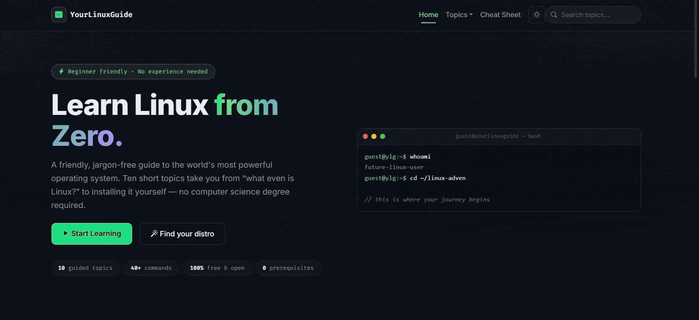

# Your Linux Guide

> **Learn Linux from Zero.** A beginner-friendly, multi-page educational website that
> teaches Linux fundamentals — no experience (or account) required.


---



## What is this?

A dark, terminal-themed learning site that takes someone who has never touched Linux
from *"what even is it?"* to installing it confidently on their own machine. Ten guided
topics, dozens of copy-pasteable terminal examples, an interactive distro-finder quiz,
and a print-friendly cheat sheet — all written in plain, jargon-free language.

## Features

- **Dark & light themes** — one-click toggle in the navbar, persisted per browser (defaults to the signature dark terminal look; terminal blocks stay dark in both)
- **10 guided topics** — each its own HTML page, ordered as a complete learning path with prev/next navigation
- **Progress tracking** — "Mark as Completed" buttons save to `localStorage`; the homepage shows a live progress bar and "Done" badges on topic cards
- **Terminal-styled code blocks** — dark background, green monospace text, macOS-style window chrome, and a one-click **copy button** (copies only the commands, never prompts or comments)
- **Navbar topic search** — instant dropdown quick-jump on every page; on the homepage it also live-filters the topic card grid
- **Interactive quiz** — "Which distro is for you?" written in vanilla JS (4 questions, weighted scoring, local result)
- **Visual diagrams in pure HTML/CSS** — distro family tree, file-system directory tree, rwx permission breakdown
- **Print-friendly cheat sheet** — dedicated `@media print` stylesheet plus a print button
- **Fully responsive** — Bootstrap 5 grid, collapsible hamburger navbar, works on mobile, tablet and desktop
- **UX polish** — smooth page fade transitions, scroll-reveal animations (IntersectionObserver), back-to-top button, smooth scrolling, breadcrumbs, auto-updating footer year

## Tech stack

| Layer | Technology |
|---|---|
| Markup | HTML5 |
| Styling | CSS3 (custom dark theme overrides) |
| UI toolkit | [Bootstrap 5.3](https://getbootstrap.com/) via CDN |
| Icons | [Bootstrap Icons](https://icons.getbootstrap.com/) via CDN |
| Fonts | [Inter](https://fonts.google.com/specimen/Inter) (body) · [Fira Code](https://fonts.google.com/specimen/Fira+Code) (code) |
| Logic | Vanilla JavaScript (no frameworks, no libraries) |
| Storage | Browser `localStorage` |

**No build step, no npm, no bundler.** Open and go.

## Project structure

```
your-linux-guide/
├── index.html                  # Home: hero, progress overview, topic card grid
├── what-is-linux.html          # 01 · Linux explained, history timeline, OS comparison
├── distributions.html          # 02 · Distro families + visual family tree
├── desktop-environments.html   # 03 · GNOME/KDE/XFCE/Cinnamon, DE vs WM
├── terminal-and-shell.html     # 04 · Terminal vs shell + 13 core commands
├── package-managers.html       # 05 · apt/pacman/dnf/flatpak/snap + comparison table
├── file-system.html            # 06 · Directory tree diagram + branch guide
├── users-and-permissions.html  # 07 · Root, sudo, rwx diagram, chmod
├── essential-concepts.html     # 08 · Kernel, X11 vs Wayland, GRUB, systemd, repos
├── getting-started.html        # 09 · Live USB, install guide, distro quiz
├── cheat-sheet.html            # 10 · Print-friendly quick reference
├── styles.css                  # Custom dark theme (overrides Bootstrap)
├── main.js                     # All interactivity (vanilla JS, commented)
└── README.md
```

## Run it locally

### Option 1 — open the file

Double-click `index.html`. Everything works straight from the filesystem.

### Option 2 — local server (recommended)

From the project folder:

```bash
# Python 3 (preinstalled on Linux/macOS)
python3 -m http.server 8000

# …or Node.js
npx http-server -p 8000
```

Then visit **http://localhost:8000**. Stop the server with `Ctrl + C`.

> **Tip:** VS Code users can install *Live Server* and right-click `index.html` →
> *Open with Live Server* for auto-reload on save.
>
> Progress is stored per origin — `file://` and `localhost` keep separate save data.

## How progress tracking works

Topic completion lives in `localStorage` under the key `ylg-progress` as a simple
JSON array of topic ids:

```json
["what-is-linux", "terminal-and-shell", "file-system"]
```

Every "Mark as Completed" button toggles its topic id in that array. On the homepage,
`main.js` reads the array to render the progress bar (`X of 10 topics completed`,
percentage) and marks finished topic cards with a green badge. To reset progress, clear
the key in DevTools → *Application → Local Storage*, or run:

```js
localStorage.removeItem("ylg-progress")
```

## Customizing

- **Colors** — all theme values are CSS custom properties at the top of `styles.css`
  (`--ylg-green`, `--ylg-purple`, `--ylg-bg`, …). Change one variable, theme the whole site.
- **Add a topic** — create the HTML page (copy any topic page as a template), then add a
  matching entry to the `TOPICS` array at the top of `main.js` so it appears in search,
  progress tracking and the homepage grid.
- **Fonts** — swap the Google Fonts `<link>` in each page's `<head>`.

## Browser support

Works in all modern browsers (Chrome, Edge, Firefox, Safari). Clipboard copying uses the
async Clipboard API with an `execCommand` fallback for older/ non-secure contexts. Honors
`prefers-reduced-motion`.

## License

MIT — free to use, learn from, remix and share. Built with HTML, CSS, Bootstrap 5 and
vanilla JavaScript. *From zero to `sudo` — one topic at a time.*
